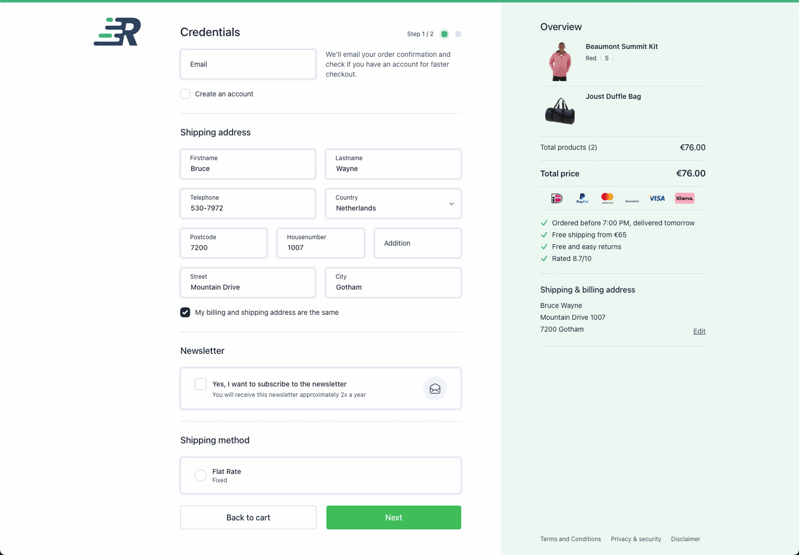

# Rapidez Confira

This package extends [rapidez/checkout-theme](https://github.com/rapidez/checkout-theme) with customized styling and components. It maintains all the functionality of the original checkout theme while providing a different visual experience.



## Prerequisites

Before installing this package, make sure you have:
1. A working [Rapidez](https://github.com/rapidez/rapidez) installation
2. The [Rapidez Checkout Theme](https://github.com/rapidez/checkout-theme) installed and configured

## Installation

1. First ensure you have installed and configured the base checkout theme properly
2. Install this package via Composer:
```bash
composer require rapidez/confira
```

## Layout Configuration

For the best experience with this theme, it's recommended to have a clean checkout page layout without header and footer. To achieve this, modify your project's `app.blade.php`:

```diff
<div id="app" class="flex flex-col min-h-dvh">
    @includeWhen(!request()->is('checkout'), 'rapidez::layouts.partials.header')
-    @includeWhen(request()->is('checkout'), 'rapidez::layouts.checkout.header')
    <main>
        @yield('content')
    </main>
    @includeWhen(!request()->is('checkout'), 'rapidez::layouts.partials.footer')
-    @includeWhen(request()->is('checkout'), 'rapidez::layouts.checkout.footer')
    @stack('page_end')
</div>
```

This configuration will:
- Remove the checkout-specific header and footer
- Keep the standard site header and footer for non-checkout pages
- Create a cleaner checkout experience

## Configuration

You can publish the config to customize the Confira-specific settings:
```bash
php artisan vendor:publish --tag=rapidez-confira-config
```

## Views

If you need to customize the Confira styling further, you can publish its views:
```bash
php artisan vendor:publish --tag=rapidez-confira-views
```

Note: It's recommended to only publish and modify the specific views you need to change, rather than all views. This makes it easier to maintain and update the package.

## License

GNU General Public License v3. Please see [License File](LICENSE) for more information.
